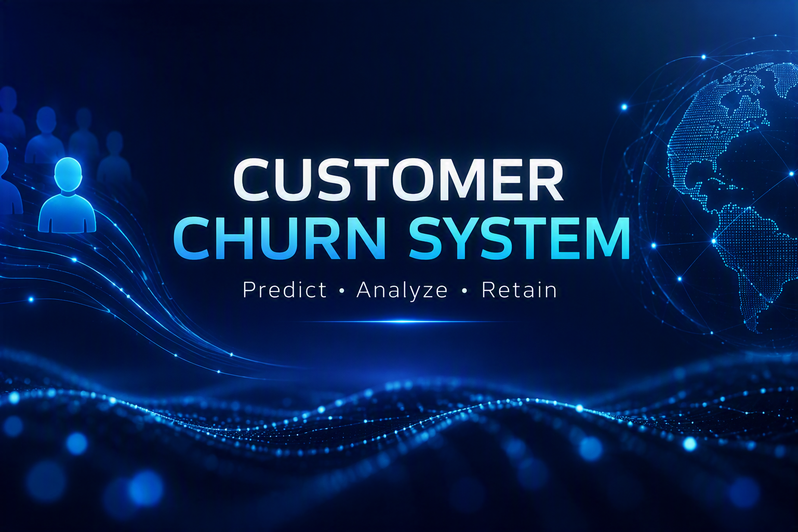

# Telco Customer Churn Prediction System

This project is an end-to-end Machine Learning pipeline designed to predict customer churn based on various account and service attributes. It covers the entire lifecycle from data preprocessing and model training to containerized model serving via a REST API.

<p align="center">
  
</p>

## 🚀 Features

- **Machine Learning Models**: Training pipelines for Random Forest, XGBoost, and LightGBM models.
- **Model Serving**: High-performance REST API built with **FastAPI** and scaled with **Gunicorn** workers. Models are exported to **ONNX** format for fast CPU inference. Features both single and batch prediction endpoints.
- **Experiment Tracking**: Integrated with **MLflow** for tracking model parameters, metrics (Precision, Recall, ROC-AUC), and artifacts.
- **Data Versioning**: **DVC** (Data Version Control) is used to track changes to the dataset (`data/Telco-Customer-Churn.csv`).
- **Orchestration**: Includes an **Apache Airflow** DAG (`weekly_churn_pipeline.py`) to automate and schedule periodic pipeline runs.
- **Dependency Management**: Uses **uv** for ultra-fast, reproducible Python dependency resolution and installation.
- **Containerization**: Fully Dockerized API and unified `docker-compose` environment for running the API, MLflow, and Airflow simultaneously.
- **CI/CD**: Configured with **GitHub Actions** for automated linting, formatting (using `Ruff`), testing (using `Pytest`), and Docker build validation.

---

## 🛠️ Project Structure

- `app.py`: FastAPI service that serves the ONNX model and handles inference requests.
- `src/`: Source code for the ML pipeline.
  - `train.py`: End-to-end training and evaluation script.
  - `save_model.py`: Script to export trained models to the ONNX format.
  - `preprocessing.py`: Data preprocessing logic.
  - `models_builder.py`: Definitions for various ML model architectures.
- `configs/`: Configuration files (YAML) for training, app, and data.
- `data/`: Contains the dataset (managed by DVC).
- `tests/`: Pytest suite for the application.
- `$AIRFLOW_HOME/dags/`: Apache Airflow DAGs.
- `dockerfile`: Docker configuration for the FastAPI service.
- `pyproject.toml` / `uv.lock`: Project dependencies managed by `uv`.

---

## ⚙️ Setup and Installation

### Prerequisites
- Python >= 3.13
- [uv](https://docs.astral.sh/uv/) for dependency management.
- Docker (optional, for containerization).

### Installation

1. **Clone the repository:**
   ```bash
   git clone https://github.com/ahmed123-cell/Customer-Churn-System
   cd "Customer Churn System"
   ```

2. **Install dependencies using `uv`:**
   ```bash
   uv sync --all-groups
   ```
   *This command creates a virtual environment (`.venv`) and installs all project and development dependencies.*

3. **Pull Data (if DVC remote is configured):**
   ```bash
   dvc pull
   ```

---

## 💻 Usage Commands

### 1. Model Training
Run the end-to-end training script to evaluate all models on the dataset:
```bash
uv run python src/train.py
```
*(You can also pass arguments like `--data data/Telco-Customer-Churn.csv --test-size 0.2`)*

### 2. Exporting a Model
Train and export a specific model (e.g., Random Forest) to ONNX format. This creates the necessary artifacts (the `.onnx` model, `scaler.joblib`, and `feature_names.json`) inside the `artifacts/` directory.
```bash
uv run python src/save_model.py --data data/Telco-Customer-Churn.csv --model random_forest
```

### 3. Running the API (Development)
Start the FastAPI server locally. Ensure you have generated the model artifacts first using the command above.
```bash
uv run uvicorn app:app --host 0.0.0.0 --port 8000 --reload
```
- **Frontend UI**: Hosted directly at [http://localhost:8000/](http://localhost:8000/)
- **API Documentation**: Interactive Swagger docs available at [http://localhost:8000/docs](http://localhost:8000/docs)
- **Batch Inference**: Submit multiple records at once via the `/predict_batch` endpoint.

### 4. Running Tests
Run the test suite with coverage reporting:
```bash
uv run pytest tests/ -v --cov=. --cov-report=term-missing
```

### 5. Linting and Formatting
Check and format your code using Ruff:
```bash
uv run ruff check .
uv run ruff format .
```

---

## 🐳 Docker Containerization

The project includes a unified `docker-compose.yml` to spin up the entire MLOps stack, as well as a standalone `Dockerfile` to package the FastAPI application using Gunicorn and Uvicorn workers.

### Option 1: Docker Compose (Recommended)
Launch the API, MLflow tracking server, and Apache Airflow simultaneously:
```bash
docker-compose up --build
```
- **API + UI**: [http://localhost:8000](http://localhost:8000)
- **MLflow**: [http://localhost:5000](http://localhost:5000)
- **Airflow**: [http://localhost:8080](http://localhost:8080)

### Option 2: Standalone Docker Image

**1. Build the Docker image:**
```bash
docker build -t churn-api .
```

**2. Run the container:**
Mount the locally generated `artifacts/` folder to the container so that the API can load the ONNX model without needing to rebuild the image if the model changes.
```bash
# On Linux/macOS
docker run -p 8000:8000 -v "$(pwd)/artifacts:/app/artifacts" churn-api

# On Windows (PowerShell)
docker run -p 8000:8000 -v "${PWD}/artifacts:/app/artifacts" churn-api
```

---

## 📄 License

This project is licensed under the [MIT License](LICENSE).
